# Architecture Microservices avec Spring Cloud

## Description du Projet

Application basée sur une architecture microservices permettant de gérer les **factures** contenant des **produits** et appartenant à des **clients**.

---

## Objectifs

- Créer une architecture microservices complète
- Implémenter la communication inter-services avec OpenFeign
- Mettre en place un système de découverte de services avec Eureka
- Configurer une Gateway pour le routage
- Centraliser la configuration avec Config Service

---

## Architecture

```
┌─────────────────────────────────────────────────────────────┐
│                      Config Service                          │
│                     (Port: 8888)                             │
└─────────────────────────────────────────────────────────────┘
                            │
                            ▼
┌─────────────────────────────────────────────────────────────┐
│                   Eureka Discovery Service                   │
│                     (Port: 8761)                             │
└─────────────────────────────────────────────────────────────┘
                            │
        ┌───────────────────┼───────────────────┐
        ▼                   ▼                   ▼
┌──────────────┐    ┌──────────────┐    ┌──────────────┐
│   Gateway    │    │   Customer   │    │  Inventory   │
│ (Port: 8888) │    │   Service    │    │   Service    │
└──────────────┘    │ (Port: 8081) │    │ (Port: 8083) │
        │           └──────────────┘    └──────────────┘
        │                   ▲                   ▲
        │                   └───────┬───────────┘
        ▼                           │
┌──────────────────────────────────┴───────────────────┐
│              Billing Service                          │
│              (Port: 8084)                             │
│              (OpenFeign Client)                       │
└───────────────────────────────────────────────────────┘
```

---

## Technologies Utilisées

- **Java 21+**
- **Spring Boot 3.x**
- **Spring Cloud** (Eureka, Gateway, OpenFeign, Config)
- **Spring Data JPA**
- **Spring Data REST**
- **H2 Database** (pour le développement)
- **Lombok**
- **Maven**

---

## Microservices

### 1️⃣ Customer Service (Port: 8081)

**Description:** Gestion des clients

**Endpoints:**
- `GET /api/customers` - Liste tous les clients
- `GET /api/customers/{id}` - Récupère un client par ID
- `POST /api/customers` - Crée un nouveau client
- `PUT /api/customers/{id}` - Met à jour un client
- `DELETE /api/customers/{id}` - Supprime un client

**Entité Customer:**
```java
- id: Long
- name: String
- email: String
```

**Base de données:** H2 Console accessible via `http://localhost:8081/h2-console`

---

### 2️⃣ Inventory Service (Port: 8083)

**Description:** Gestion des produits

**Endpoints:**
- `GET /api/products` - Liste tous les produits
- `GET /api/products/{id}` - Récupère un produit par ID
- `POST /api/products` - Crée un nouveau produit
- `PUT /api/products/{id}` - Met à jour un produit
- `DELETE /api/products/{id}` - Supprime un produit

**Entité Product:**
```java
- id: String (UUID)
- name: String
- price: double
- quantity: int
```

**Particularité:** Utilise Spring Data REST avec exposition des IDs

---

### 3️⃣ Gateway Service (Port: 8888)

**Description:** Point d'entrée unique pour tous les microservices

**Configuration Dynamique:**
- Routage automatique basé sur les noms de services enregistrés dans Eureka
- Format: `http://localhost:8888/{SERVICE-NAME}/**`

**Exemples d'accès:**
```
http://localhost:8888/CUSTOMER-SERVICE/api/customers
http://localhost:8888/INVENTORY-SERVICE/api/products
http://localhost:8888/BILLING-SERVICE/bills/1
```

**Avantages:**
- Point d'entrée unique
- Load balancing automatique
- Isolation des microservices

---

### 4️⃣ Eureka Discovery Service (Port: 8761)

**Description:** Annuaire de services pour la découverte dynamique

**Dashboard:** `http://localhost:8761`

**Services enregistrés:**
- customer-service
- inventory-service
- billing-service
- gateway

**Fonctionnalités:**
- Enregistrement automatique des services
- Health check
- Load balancing

---

### 5️⃣ Billing Service (Port: 8084)

**Description:** Gestion des factures (utilise OpenFeign pour communiquer avec Customer et Inventory)

**Endpoints:**
- `GET /bills/{id}` - Récupère une facture complète avec customer et products

**Entités:**

**Bill:**
```java
- id: Long
- billingDate: Date
- customerId: Long
- productItems: List<ProductItem>
- customer: Customer (transient)
```

**ProductItem:**
```java
- id: Long
- productId: String
- quantity: int
- unitPrice: double
- bill: Bill
- product: Product (transient)
```

**Feign Clients:**
- `CustomerRestClient` → Appelle customer-service
- `ProductRestClient` → Appelle inventory-service

---

### 6️⃣ Config Service (Port: 8888)

**Description:** Serveur de configuration centralisé

**Repository Git:** Contient les fichiers de configuration de tous les services

**Structure du repo:**
```
config-repo/
├── customer-service.properties
├── inventory-service.properties
├── billing-service.properties
└── gateway.properties
```

**Avantages:**
- Configuration centralisée
- Gestion de configuration par environnement (dev, prod)
- Mise à jour dynamique sans redémarrage

---

## Captures d'Écran

### Dashboard Eureka Discovery Service
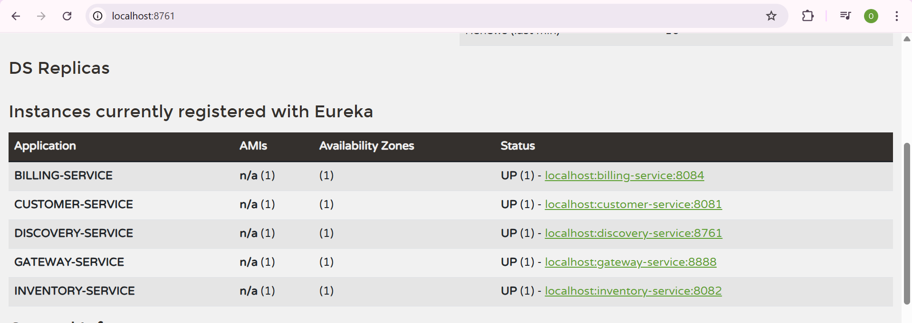

---

### Customer Service - Liste des Clients
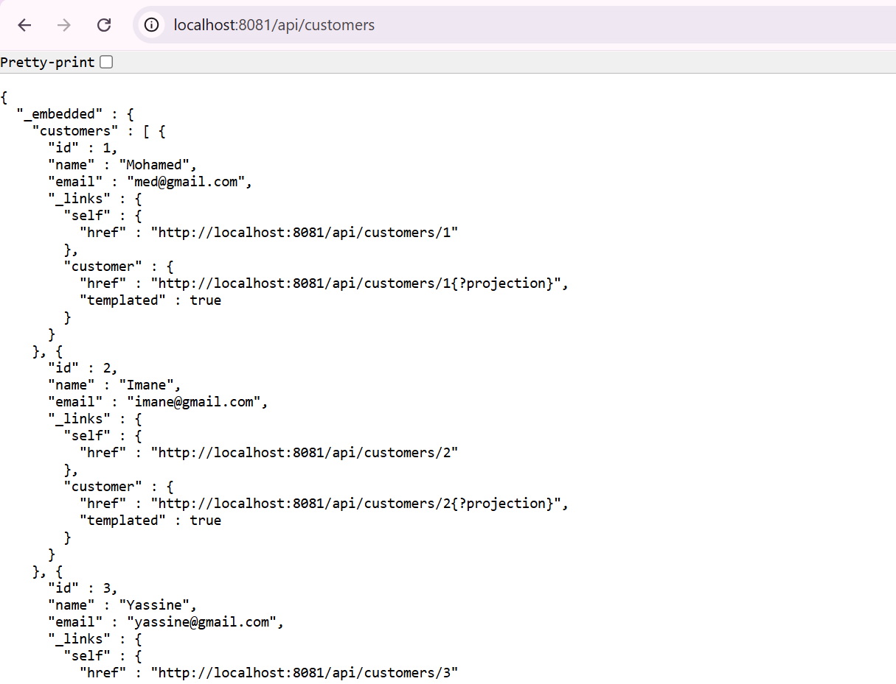

---

### Customer Service - Base de données Customers
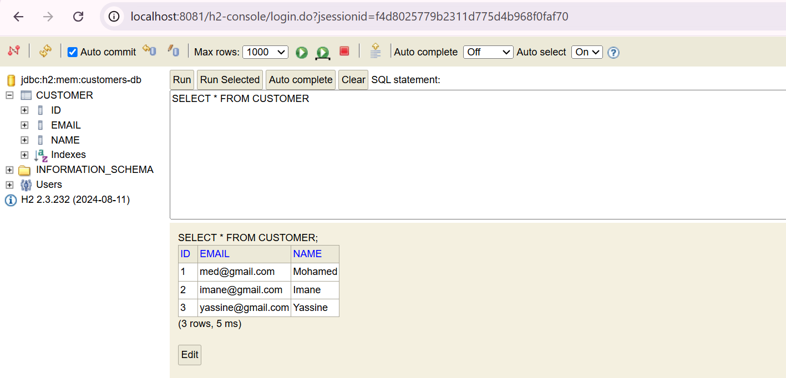

---

### Customer Service - Base de données Products
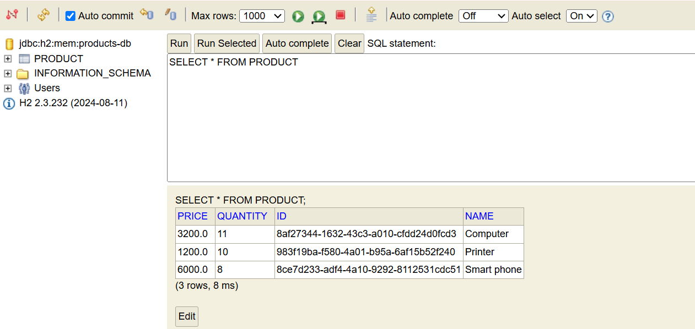

---

### Inventory Service - Base de données des Produits
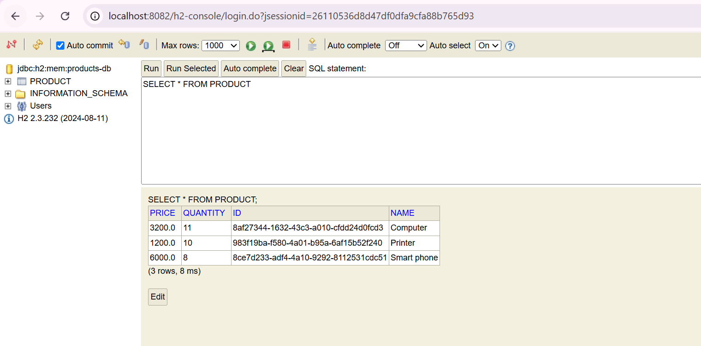

---

### Inventory Service - Liste des Produits
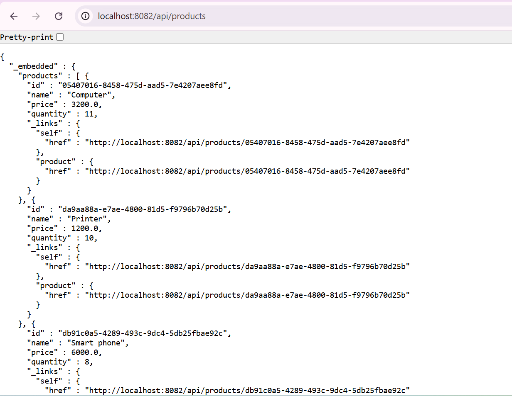

---

### Billing Service - Facture Complète
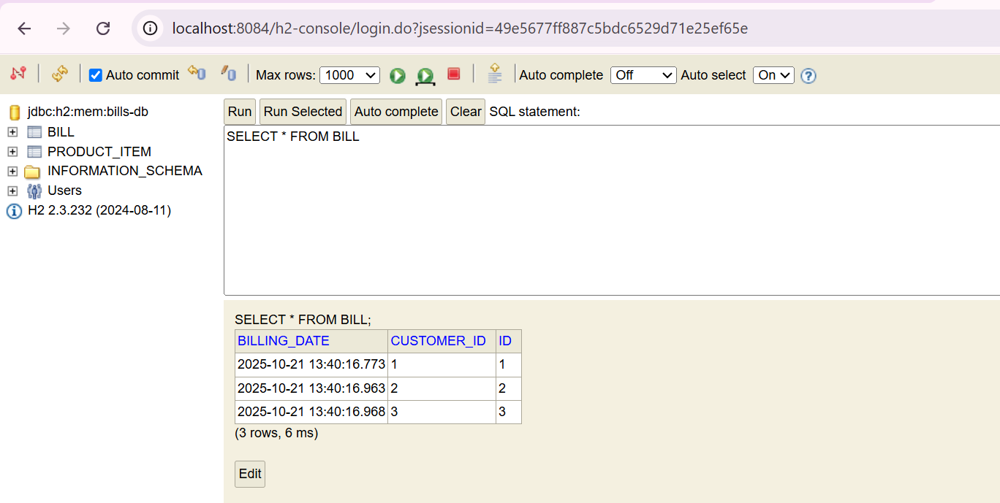
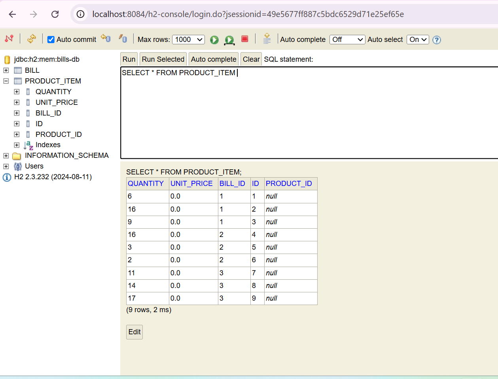
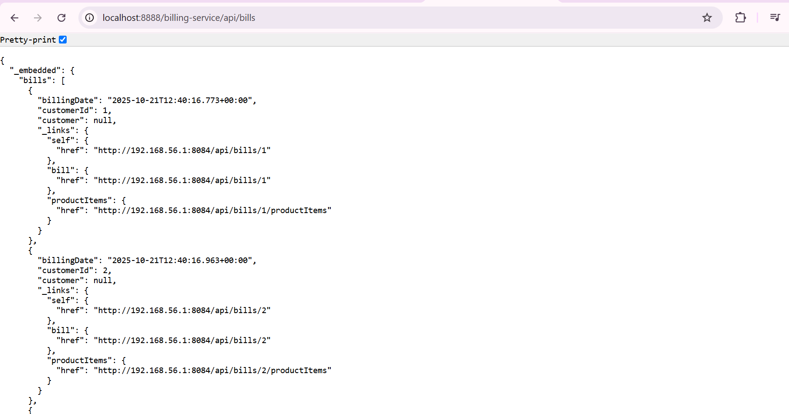

---

### Gateway - Routage via Gateway
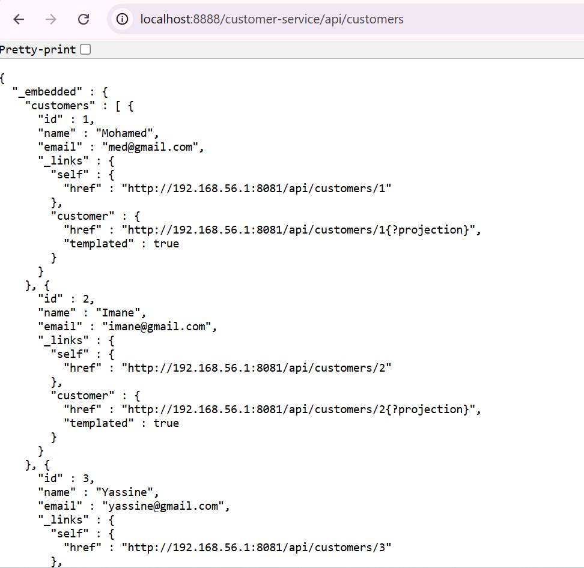
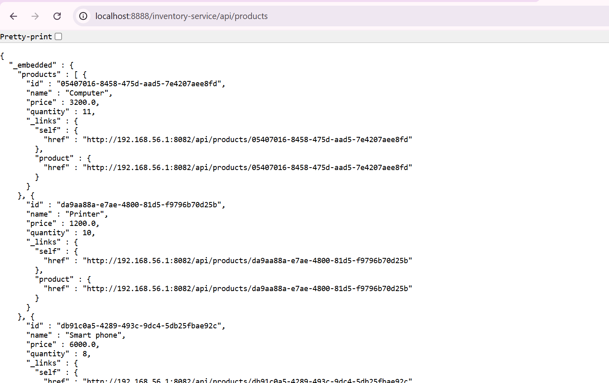

---

## Configuration

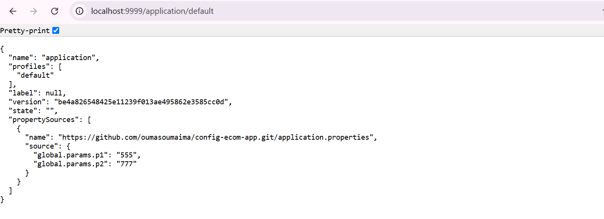
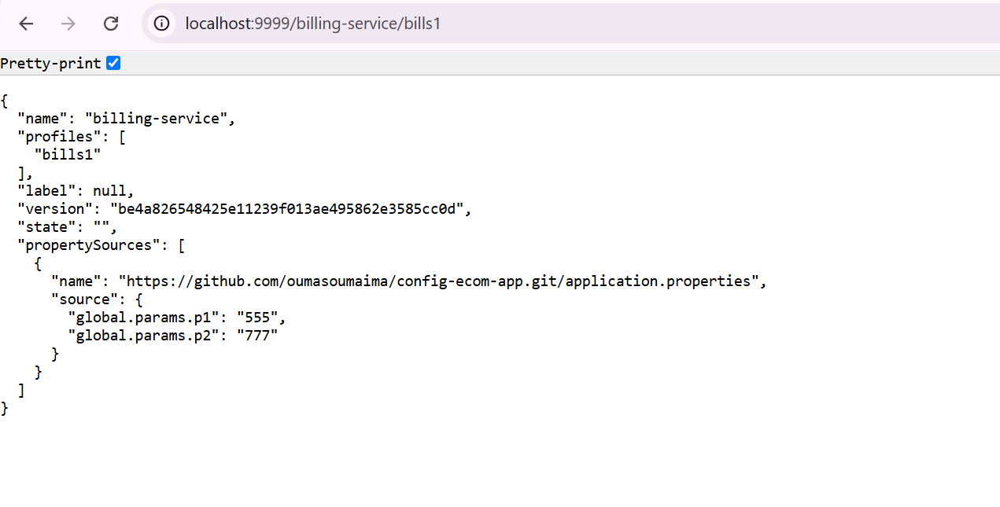

### Ports utilisés
| Service | Port |
|---------|------|
| Config Service | 8888 |
| Eureka Server | 8761 |
| Gateway | 8888 |
| Customer Service | 8081 |
| Inventory Service | 8083 |
| Billing Service | 8084 |

### Fichiers de configuration importants

**application.properties (exemple pour Customer Service):**
```properties
spring.application.name=customer-service
server.port=8081
spring.datasource.url=jdbc:h2:mem:customer-db
spring.h2.console.enabled=true
eureka.client.service-url.defaultZone=http://localhost:8761/eureka
```

---

## Travail Réalisé

- ✅ 1. Micro-service customer-service
- ✅ 2. Micro-service inventory-service
- ✅ 3. Gateway Spring Cloud Gateway
- ✅ 4. Configuration statique du routage
- ✅ 5. Eureka Discovery Service
- ✅ 6. Configuration dynamique des routes
- ✅ 7. Billing-Service avec OpenFeign
- ✅ 8. Config Service

---

## Concepts Clés Appris

1. **Architecture Microservices:** Décomposition d'une application monolithique
2. **Service Discovery:** Découverte dynamique avec Eureka
3. **API Gateway:** Point d'entrée unique et routage
4. **Communication inter-services:** OpenFeign pour les appels REST
5. **Configuration centralisée:** Spring Cloud Config
6. **Résilience:** Isolation des services

---

**Note:** Ce projet est réalisé dans un cadre pédagogique pour comprendre les principes de l'architecture microservices avec Spring Cloud.